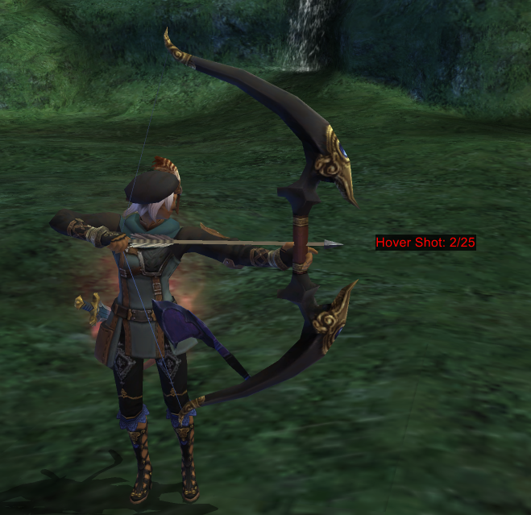
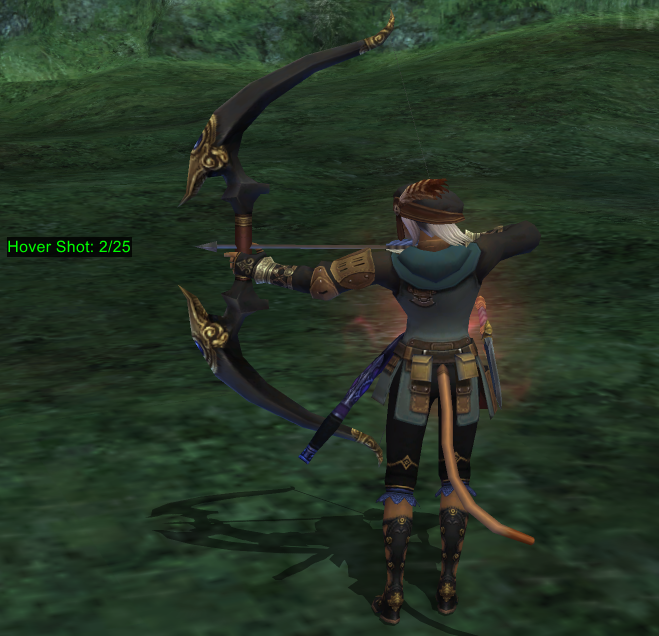

# HoverTracker

Super light-weight and simple FFXI add-on for tracking Hover Shot stacks and validating the movement requirement for gaining stacks.

Red = You need to move (more)


Green = You may fire when ready!


Usage:
```lua
//lua load hovertracker
```

Automatic visual display when Hover Shot is active a enemy has been claimed.

Commands:
```lua
-- Enable display (display enabled by default) 
//ht show

-- Hide display
//ht hide

-- Manually reset stack count
//ht reset
```